# Testing Load Balancer Connectivity Across Multiple EC2 Instances

## A complete step-by-step guide to configuring an AWS Load Balancer with target groups

Create EC2 Instances

Create and configure target groups for EC2 instances

 Configure an AWS Load Balancer to filter and distribute traffic

### This project will demonstrate how to

Set up multiple EC2 instances

Create and configure target groups

Register EC2 instances with the target groups

Attach target groups to an AWS Load Balancer

Verify load balancer traffic distribution across EC2 instances in the target groups
#### Step-by-Step Instructions Guidance

* Select EC2 from the Dashboard.

  
  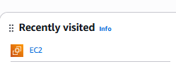  

  

Select Security Groups from the left-hand navigation panel.

  
  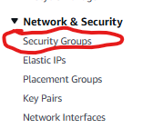  

 
* Select Create Security Group

  
    

  
*In the Basic Details Section of the Create Security Groups Page, give your Security Group a name and a description.

  
  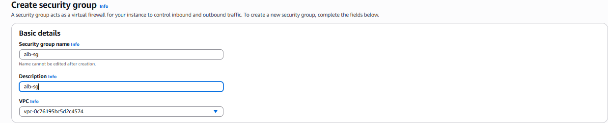  

  
* For the Security Groups Inbound Rules, set up HTTP Port 80 to be opened for Anywhere IPV4. (The purpose is that we want anyone to be able to access the website's load balancer that we will soon be creating.)

  
  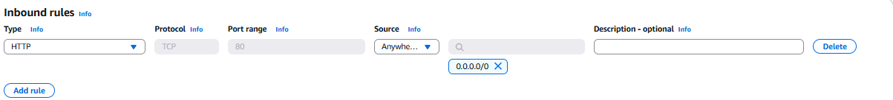  

  
* Click Create Security Group on the bottom to complete the creation of the Security Group.

  
  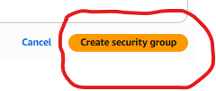  

  

* Repeat the process of creating the Security Group. However: 

1) Create a different EC2 username 

2) Leave the Inbound and Outbound Rules Blank.

*Select Instances from the Navigation Panel 

  
  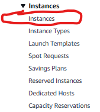  

  

*Select Launch Instances Tab

  
  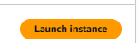  

  

* Give Your Instance a Name and Select an AMI for the Instance

  
    

  

* Select Instance Type and Keypair for your Instance.

  
    

  

* Under Network Settings, Select Existing Security Group and the 2nd Security group that was previously created (the security group that was previously instructed to leave both the Inbound and Outbound Rules Blank).

  
  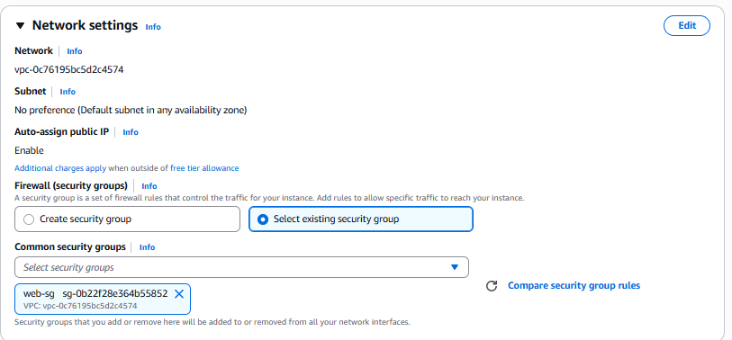  

  

*Select Edit tab from the Network Settings

  
  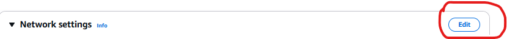  

  

* Select Availability Zone from Expanded Options Network Settings and Type the Region-A that you are in (see photo for comparsion to have proper setup.)

  
  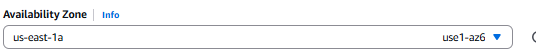  

  

* Scroll further down the page and select the Advanced Details Tab

  
  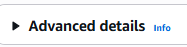  

  
* In the Advanced Details Tab, Scroll Down to the section where it says User Data and has a box right underneath it.

  
  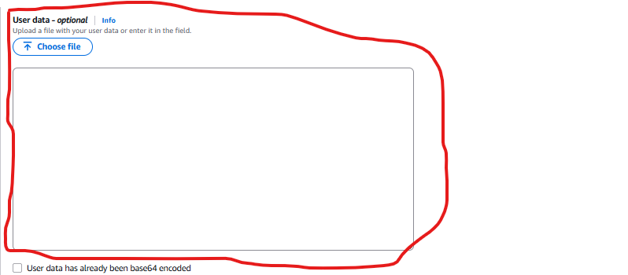  

  

* Type the code (from the below photo) into the User Data Box/. (This will allow any user to access the EC2 Loadbalncer which we will create later on.)

  
  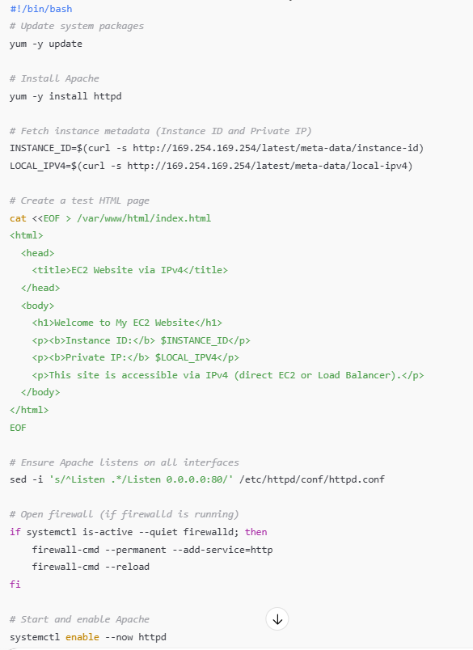  

  

* Select the Launch Instance tab at the bottom to complete Instance Creation.

  
    

  

* Now click the Pencil Icon on the newly created Instance and Modify the Name of your Instance to finsih with "-A".

  
    

  

* Select the Launch Instance Tab

  
    

  

* Repeat the above process of setting up the Instance with 2 slight variations.

*   1) The name of your instance should be different from the name of the previous instance set up.
*   2) Select from the Availability Zone in Network Settings and type the Region-B that you are in.

SELECT TARGET GROUP(S) FOR FUTURE CONNECTION TO LOAD BALANCER

* With EC2 Instances Created, select Target Group from the left-hand options.

  
  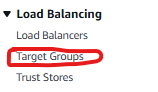  

  

* Select the Create target Button

  
    

  

* On Create Target Group, Give the Target Group a Name.

  
  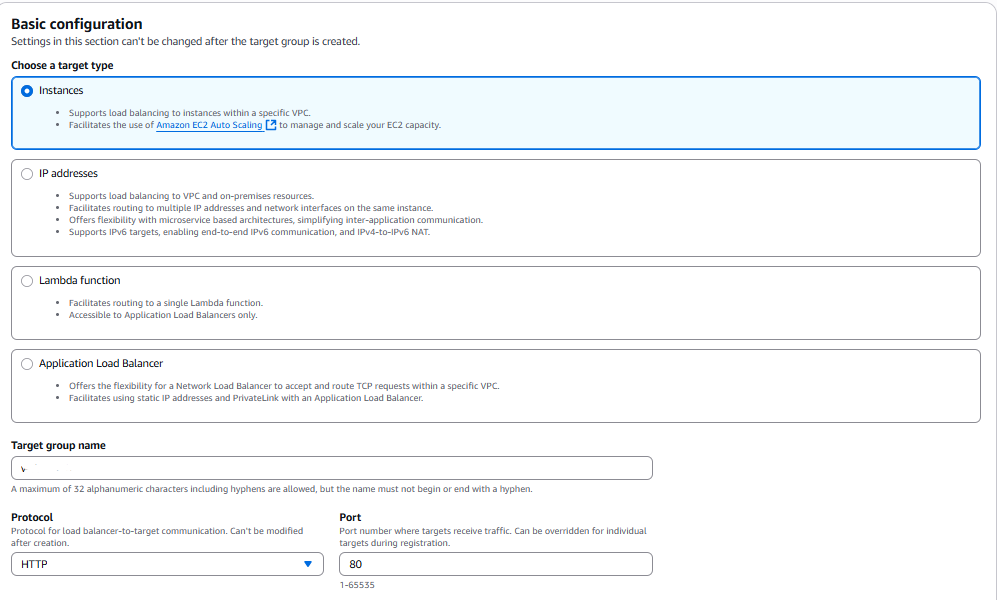  

  

* Click Next at the bottom of the Create Target Group Page

  
    

  

* Select Create Target Group button at the bottom

  
  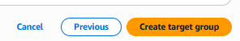  

  

* Select both EC2'S Click Deregister

  
    

  

SETTING UP THE LOAD BALANCER

* Select Load Balancer from the left-handed options

  
  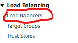  

* Click the Create Load Balancer button

  
    

* Select Application Load Balancer

  
  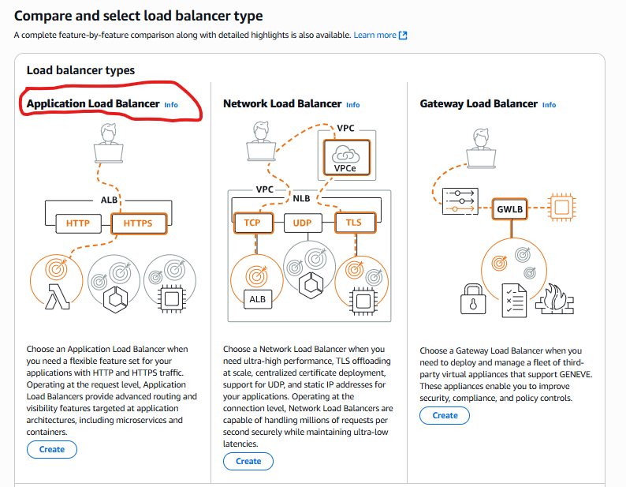  

* Give your Load Balancer a name in the Basic Configuration Section

  
  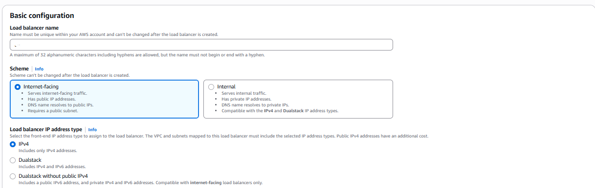  

* In the Network Mapping Section, select the 2 Availability Zones that you created earlier.

  
  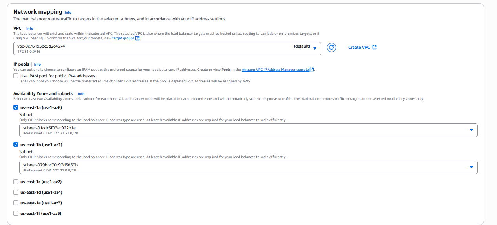  

*  In the Security Group Section, Remove the Default Security Group and replace it with the  "alb-sg". That is the first security group we created(specfially for the load balancer rules)

  
  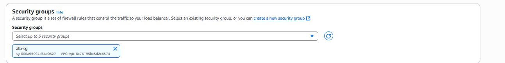  

*  In the Listening and Routing Section, Select the Target Group Created Earlier in the Target Group Box.

  
  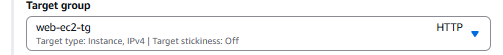  

* Scroll to the bottom and select Create Load Balancer.

  
    

BACK IN SECURITY GROUPS

* Select Security Group from the left-hand options

  
    

* Search  the earlier created security group name "web-sg" in the search box

  
    

* Select the Security Group ID for "web-sg".

  
  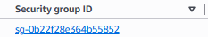  

* Select Edit Inbound Rules

  
    

* Click Add Rule

  
  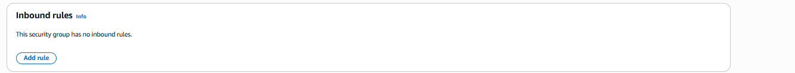  

* Select HTTP for Type, Select Custom for Source and type "alb-sg" in search box(it will populate in the search box as the suffix to the security group once I click on it.)

  
    

* Click Save Rules

  
    

##### Contribution Policy

This project is not accepting external contributions, including pull requests or feature requests.
